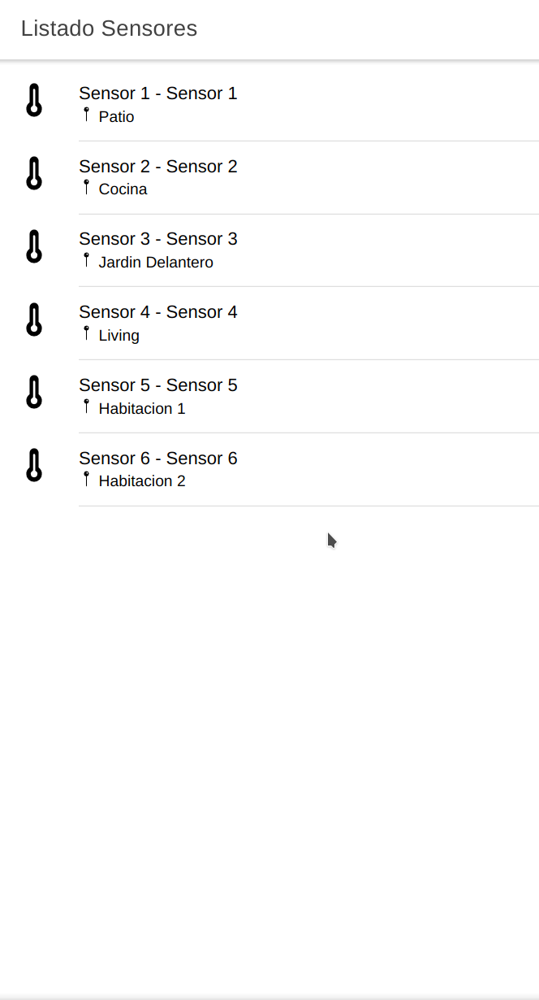
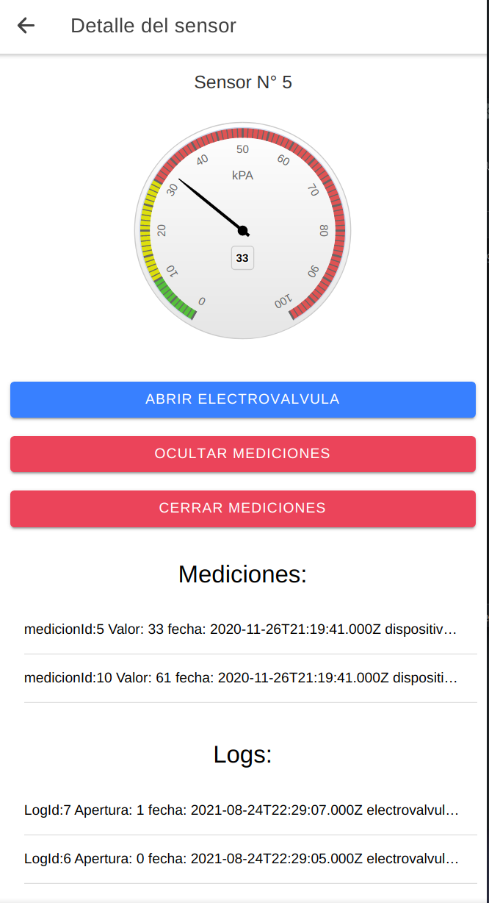

# Trabajo Fianl Desarrollo de aplicaciones Multiplataforma. 
## Especialización IoT. FIUBA




El presente trabajo se integra de 3 partes:
- Frontend
- Backend
- Base de datos

### Instalacion

Backend y base de datos:
``` docker-compose up ```

Frontend:
```sudo npm install --save```

Correr frontend : 
```ionic serve```

### API

```
Dispositivos

GET /api/dispositivo
GET /api/dispositivo/:id

Logs

GET /api/dispositivo/:id/logs
POST /api/dispositivo/:id/agregarLog

Mediciones

GET /api/medicion/:id
GET /api/medicion/:id/ultima

POST /api/medicion/:id/todas
POST /api/medicion/:id
```

### Manual de uso

Al iniciar la applicacion, se muestran automaticamente el listado de sensores.
Una vez cargado el lista se puede seleccionar alguno de ellos y pasar a la vista de visualizacion de sensor. En esta vista, se presentan:
 - El ultimo valor de medicion obtenido a traves de un grafico de aguja.
 - Un boton para accionar la electrovalvula.
    - Esta accion disparara dos eventos:
        - Un evento de log
        - Un evento de nueva medicion cuando la electrovalvula se cierre.
 - Un boton para acceder al listado historico de mediciones del sensor.
 - Un boton para acceder al log de riego.
 - Todas las actualizaciones de mediciones y accionamiento automaticamente actualizan los correspondientes logs.
